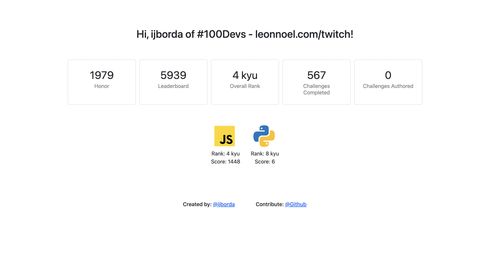

# Codie | See your Codewars Stats at a Glance

Use [Codie](http://imarijoyborda.com/codie/) to see your [Codewars](https://www.codewars.com/) stats at a glance.

Link to project:[http://imarijoyborda.com/codie/](http://imarijoyborda.com/codie/). 

## How To Use
Enter your username and press `generate`. You will see your `honor`, `leaderboard position`, `overall rank`, number of `challenges completed`, and number of `challenges authored`. You will also see the `rank` and `scores` you have for each programming languages you used.

## How It's Made
This uses [Codewars API](https://dev.codewars.com/#introduction). Tech used: HTML, CSS, Bootstrap, and JavaScript.

## Future Improvements
There are still lots that need to be improved in this web application. Some plans are:
* Improve the frontend design
* Improve responsivenes
* Add response where username does not exist
* Refactor the scripts
* Add more stats to show
* Add .png files of different programming languages [here](https://github.com/ijborda/codewars-api/tree/main/assets/proglang). 

Contributions are also very welcome! Just issue a pull request.

## Sources
This is where the .png files of the programming languages were obtained:
* https://iconscout.com/
* https://icons8.com/
* https://icon-icons.com/